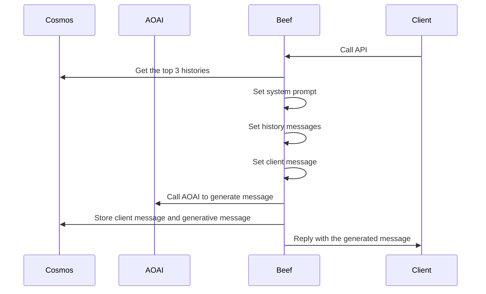

Beef x AI
---
The purpose of the sample is demonstrate the usage of _Beef_ in a Gen AI scenario. 

Use Azure OpenAI to have conversations.

> [!WARNING]
> The tools you use include a preview.
> Use of this code should be considered carefully.

Prerequisites
---
You need to deploy one of the models from Azure OpenAI Service.

Scope
---
| Endpoint | Description |
| -- | -- |
| POST /chats | Create a new chat history |
| POST /chats/completion | generative AI message |

Cosmos DB usage
---
- `RefData` - manage role.
- `Chat` - manage chat history.

Solution skeleton
---
```
dotnet new beef --company AIChat --appname AOAI --datasource Cosmos
```

Code Generation
---
Please copy the .yaml of this project.

Then run the following command.
```
dotnet run all
```


Install AI tools
---
You need to install the following AI tools.
```
dotnet add package Microsoft.SemanticKernel --version 1.41.0
dotnet add package Aspire.Azure.AI.OpenAI --version 9.1.0-preview.1.25121.10
dotnet add package Microsoft.SemanticKernel.Connectors.AzureOpenAI --version 1.41.0
```

Add `global using Microsoft.SemanticKernel;` to `GlobalUsings.cs` 


Design
---
The flow of this sample is as follows.


Startup
---
Add the semantic kernel using Azure OpenAI Client.
```csharp
// Add the semantic kernel
builder.Services.AddKernel()
    .AddAzureOpenAIChatCompletion(
        builder.Configuration["AzureOpenAI::ModelName"] ?? string.Empty,
        builder.Configuration["AzureOpenAI::Endpoint"] ?? string.Empty,
        builder.Configuration["AzureOpenAI::APIKey"] ?? string.Empty
    );

builder.Services.AddTransient((serviceProvider) => {
    return new Kernel(serviceProvider);
});
```

To use Azure OpenAI Service, add the following to appsettins.json
```json
"AzureOpenAI:": {
	"ModelName": "<your-model-name>",
	"Endpoint": "https://<your-ai-resource-name>.openai.azure.com/",
	"APIKey": "<your-api-key>"
},
```

Validation
---
ToDo

Test
---
ToDo


REFERENCES
---
1. [MSLearn - RAG Chatbot](https://learn.microsoft.com/en-us/azure/cosmos-db/gen-ai/rag-chatbot)
2. [MSLearn - SemanticKernel](https://learn.microsoft.com/ja-jp/semantic-kernel/overview/)
3. [MSLearn - .NET Aspire](https://learn.microsoft.com/ja-jp/dotnet/aspire/)